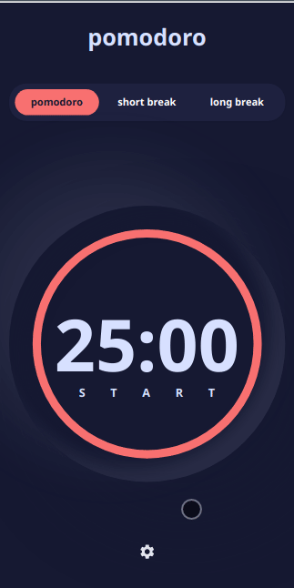

# Frontend Mentor: Pomodoro Timer Challenge

**Challenge**: https://www.frontendmentor.io/challenges/pomodoro-app-KBFnycJ6G

> FrontendMentor challenges are provided as ready for implementation
> designs and described functionality. Recently I discovered and played a bit with the
> AlpineJS and Tailwind frameworks and this project look like something that I can try
> to build using these technologies.

- [Overview](#overview)
- [What I Learned](#what-i-learned)
- [Development](#development)

## Overview

The idea of a [Pomodoro technique](https://en.wikipedia.org/wiki/Pomodoro_Technique) is
that during the day you can block chunks of time of 25 minutes and try to focus on doing
one thing, without any destructions.

In the FrontendMentor's design the idea is evolved to have 3 shortcut values to
set common time-chunks of 25, 5 and 15 minutes. Futhermore these values can then
be changed in the application settings.

Original design providing the circled progress-bar that runs clockwise and time
increments accordingly, however this part I changed to my liking - progress bar
and time actually reducing values, rather than increasing them. So instead of going
from 00:00 to 25:00, this implementation goes from 25:00 to 00:00 in the end.

Main Features:

- Ability to Start 3 types of timers
- Ability to change visual of the app
- Ability to pause, start and restart the timer
- Ability to customize each of the timers

## What I Learned

### Tailwind

I was initially skeptical about the utility-based framework, but
surprisingly I did ended up spending a lot less time on writing CSS
and build size of resulted CSS is quite good as well - only ~20Kb!

#### Design System

I learned that you can actually implement your specific
design system with editing the [tailwind.config.js](./tailwind.config.js).
A good idea for several branded sites is to have one shared tailwind config,
which seem to be able to help with keeping consistent styles for all small
landing pages for one company.

#### Base Classes

I was wondering, is there a place to set all text colors to specific value, and
that way cleanup the html by removing unnecessary classes, and you actually can do it
writing [base styles](https://tailwindcss.com/docs/adding-base-styles#using-css)!

#### VSCode Extensions

I usually use JetBrains IDE's at work, and quite used to them, but finding out these
amazing extensions for VSCode made me a lot more productive

- [TailwindCSS IntelliSense](https://marketplace.visualstudio.com/items?itemName=bradlc.vscode-tailwindcss)
  This extension dynamically show you which tailwind classes you can use. But what I did not expected is that
  when you define a colour pallet for your project, it will actually generate class names with the things
  defined in the [tailwind.config.js](./tailwind.config.js)
- [Headwind](https://marketplace.visualstudio.com/items?itemName=heybourn.headwind)
  I found this extension a bit later on the road, but it is exactly what I was struggling with -
  automatically ordering the classes in the html elements. A lifesaver tool for me!

### AlpineJS

#### App pattern

AlpineJS is kinda not designed to build applications, but rather to sparkle a bit of
interactivity to the static pages. We add this functionality by creating kinda small components,
and each component can have a scoped state if you use `x-data` In the case of this project, I thought that it makes sense
to have

## Development

The main tools that I used with this project:

- [Alpine JS](https://github.com/alpinejs/alpine) - A micro frontend framework with syntax similar to
  Vue JS. Amazing how easily you can add interactions to the single-page apps without heavy frameworks.
  In this projects the bigger framework might fit better (mostly because handling forms and validation is not
  a strong side of alpine), but in the end the Framework did its job and pretty well.

- [Tailwind CSS](https://tailwindcss.com) - Is a utility-based CSS framework. ideally you need to setup your
  deign system in [tailwind.config.js](./tailwind.config.js) file and use only utility functions in the code,
  no writing classes in CSS needed. It looks ugly on the first glance -> 10-20 classes putted in the HTML
  element, but there is a huge benefit of local scoped styles and that your CSS does not grow as you add new
  features to the application. In this project IMo Tailwind was a huge deal for me, allowing to style modal window
  with all the settings in less than hour.

### Dev Happiness Tools

I also used some tools that brings joy to the development process :)

- [Husky](https://github.com/typicode/husky) - A really nice tool to run formatting and linting automatically
  before you commit the code, makes your git history a pleasant experience
- [Prettier](https://prettier.io) - Opinionated code formatter, I do like that I no longer need
  to worry about poorly formatted code. And a huge benefit that it can also format CSS and HTML files!
- [Snowpack](https://www.snowpack.dev) - Like webpack but so much faster and requires less configuration.
  Initially I was planning to go with [Parcel](https://parceljs.org/) - my goto build tool that requires
  zero configuration, but sadly support for PostCSS v8 was not there, and hot-reload of styles did not worked
  at all for the Tailwind part of the project. I was pleasantly surprised how Snowpack handled the PostCSS
  part without too much hassle.

### HowTo Run The Project

1. First of all you would need a Node installed. See the latest instructions [here](https://nodejs.org/en/download/). After this step is completed, check that [NPM](https://www.npmjs.com/get-npm) tool is available to you by running `npm -v` command, that should output to the console the current NPM version installed.

1. Then you would need to install project dependencies from the [package.json](./package.json) file, by running the `npm install` command. This command will install project dependencies to run the project locally and also all development tools that make developing this project more pleasant.

1. `npm run dev` will start the development server and automatically open `localhost:8080` page in your default browser, so you should be able right away to see the project and try making changes in the codebase.
